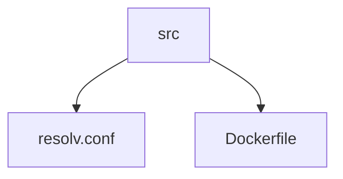

# lammps_docker
the molecular dynamics packages compiled with GPU supports . 

LAMMPS is a classical molecular dynamics simulation code designed to
run efficiently on parallel computers.  It was developed at Sandia
National Laboratories, a US Department of Energy facility, with
funding from the DOE.  It is an open-source code, distributed freely
under the terms of the GNU Public License (GPL).

this repository contain a DockerFile to compile and instal lammps on your machine. 
we hope this DockerFile be useful for your simulation. 
some package ( gpu / kokkos) need to compile and in future we add this package to lammps.


for compiling the Lammps packages need a base image ,because of own purpose ( use cuda for GPU processing )  install `nvidia/cuda` docker image. 
``` 
docker pull nvidia/cuda:10.2-devel-ubuntu18.04
```

two bellow commands must run perfectly without any error:

```
docker run --runtime=nvidia --rm nvidia/cuda:10.2-devel-ubuntu18.04 nvidia-smi
sudo docker run --rm --runtime=nvidia nvidia/cuda:10.2-devel-ubuntu18.04 nvcc --version
```
## Dockerfile for Lammps

the nvidia corporation blocks Iranian IP's, so, if you are in Iran needs to use a DNS server (see [shecan](https://shecan.ir/ ) services) to update and use `nvidia/cuda` images as base of your custom images.




### built image

```shell
docker built -t 'lammps_gpu:2020' .
```

### use image

```shell
nvidia-docker run -ti -v $(pwd):/srv/input -v $HOME/scratch:/srv/scratch lammps_gpu:2020

lmp_gpu -in /srv/lammps/bench/in.lj

mpirun -np 4 lmp_gpu -in /srv/lammps/bench/in.lj

mpirun -np 4 lmp_gpu -in /srv/lammps/bench/in.lj -sf gpu
```


### ToDo List

- [ ] add kokkos
- [ ] voronoi

 
### Completed Column ✓
~~- [x] compile lammps on ubuntu 18.04~~

- [x] add cuda   
  - [x] install cuda
  - [x] compile lammps with cuda
